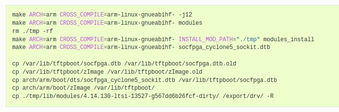
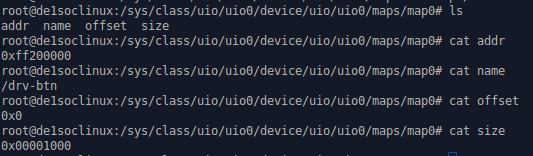

# Laboratoire 2 DRV
Spinelli isaia
29.10.19

lien du laboratoire : http://reds-calculator.einet.ad.eivd.ch/drv_2019/

[TOC]

## Téléchargement du noyau Linux et ajout des modules pour le User-space I/O

Commandes :

 - **git clone https://github.com/altera-opensource/linux-socfpga.git**
 - **cd linux-socfpga**
 - **git checkout socfpga-4.14.130-ltsi**

configuration :
**make ARCH=arm CROSS_COMPILE=arm-linux-gnueabihf- socfpga_defconfig**
architecture: arm
tool chain : arm-linux-gnueabihf
board : socfpga_defconfig
Cela permet de compiler le noyau avec toutes les configurations correspondantes à notre matériel ainsi que d'avoir une configuration pré-faite pour la famille de la board.

**grep UIO .config** permet de savoir si les userspace drivers sont actifs.
(UIO = Userspace I/O, vous trouvez l’howto officiel ici: https://www.kernel.org/doc/html/v4.14/driver-api/uio-howto.html).

Compilation avec **modification de la configuration :**

**make ARCH=arm CROSS_COMPILE=arm-linux-gnueabihf- menuconfig**

1. / UIO 	-> ajouter en module "Userspace I/O platform driver with generic IRQ handling"

   *remarque: le Userspace platform driver with generic irq and dynamic memory permet en plus de spécifier des régions dynamiques.*

2. / LBDAF -> activer "Support for large (2TB+) block devices and files"

3. exit and save

Il faut ensuite **modifier le device tree** pour qu’on puisse gérer les boutons avec le UIO driver. (save l'ancien .dts)
arch/arm/boot/dts/socfpga_cyclone5_sockit.dts-> ajouter à la ligne 23:

    drv-btn {
      compatible = "drv-btn";
      reg = <0xFF200000 0x1000>;
      interrupts = <0 41 1>;
      interrupt-parent = <&intc>;
    };

On indique l'adresse du registre et sa taille ainsi que les numéros d'interruptions.

## Compiler le noyau, les modules, et le device tree.

Avertissement : le nom du répertoire source dans la dernière commande pourrait changer!! (ajout de sudo)

Ces commandes permettent de compiler le noyau, les modules et le device tree. Ensuite, copie les anciens fichiers pour les sauvegarder et place le nouveau noyau et dtb dans le dossier **/var/lib/tftpboot/** afin de les déployer sur la carte. Finalement, place les modules précédemment compilés dans **/export/drv/**.

Finalement, après avoir boot sur la carte :
- cd /lib/modules
- rm * -rf
- mv /home/root/drv/4.14.130-ltsi-13527-g567dd6b26fcf-dirty/ .

après redémarrage, il faut vérifier que les drivers user-space soient disponible en modules avec :

**zcat /proc/config.gz | grep UIO**

# Exercices 

Afin de tester le fonctionnement des programmes, il faut commencer par les compiler avec la toolchain suivante : **arm-linux-gnueabihf-gcc**.
Ensuite, il faut placer exécutable sur la carte (via **/export/drv**). Puis l'exécuter avec "**./**".

Remarque: Le code a été écrit de manière propre à partir de l'exercice 5. Je m'en excuse d'avance et espère que vous n'y prendrez pas compte.

## Exercice 1

Afin de rechercher et analyser rapidement dans les configurations, j'utilise une interface qui me permet de facilement me balader dans les configurations. Il est possible d'avoir une interface pour configurer le noyau linux de plusieurs manière (make menuconfig ou xconfig). Personnellement, je me suis balader dans le menuconfig que je trouve plus complet.
Voici une liste des options principales configurable pour le noyaux linux :

- Configurations général (IRQ, CPU/Task time, RCU, Performance du noyau, GCC,...)
- GCOV based kernel profiling (outil d'analyse de couverture de code )
- Ordonnanceurs
- Bus options
- Kernel Features
- Boot options
- Floating point emulation
- Userspace binary formats
- CPU Power management (ACPI / SFI / CPU Frequency scaling / idle PM support)
- Network
- CAN
- Device Drivers
- Firmware
- GPIO
- Block layer
- Loadable module support
- Kernel hacking (printk/dmwesg/compiler/debug/runtime testing )
- Hardware I/O
- WathDog
- DMA / Timers / random memoire / MTRR /... (Processor type and features)
- Clock
- ADC
- Sensors
- File system
- Sécurité
- Cryptographic API
- Virtualization
- Library routines

Voici les descriptions plus détaillées des sections demandées :

##### CPU power management :

Cette section aident à réduire la consommation d'énergie et améliorent la durée de vie de la batterie pour ordinateur portable sous Linux. Un autre moyen de réduire la consommation d'énergie consiste à limiter la fréquence de votre processeur. 

##### GPIO support :

Une GPIO (General Purpose Input/Output) est une ligne d'entrée ou sortie générique sur un SoC. La prise en charge de GPIO sous Linux inclut la possibilité d’exporter le contrôle et le statut de GPIO pour une utilisation avec des applications utilisant sysfs. Des outils simples tels que *cat* et *écho* peuvent être utilisés pour lire rapidement la valeur actuelle d’une entrée GPIO ou pour définir le niveau d’une sortie GPIO. 

Dans les configuration, il est possible d'activer le debug et l'interface sysfs. De plus, il est possible de configurer directement des expanders I2C/MFD/PCI/SPI/USB.

##### Block layer :

Ce block est utilisé lorsqu'on des applications ou des systèmes de fichiers veulent accéder à divers périphériques de stockage ou lorsque les périphériques  font des demandes en mode bloc du système. Il fournit diverses fonctions de support pour simplifier et optimiser la communication.

Dans les configurations, il est possible d'activer ce block pour plusieurs type de support. Il y a aussi la possibilité d'avoir un traçage pour le débogage. 

##### Kernel hacking :

Cette section permet d'avoir des informations complémentaire sur le débogage du noyau en général. Que ce soit au démarrage, au crash, à la compilation, il y a vraiment beaucoup d'options. Par exemple, le l'interface Tracers est activé, il permet de suivre toutes les fonctions du noyau. Il est aussi par exemple possible d'avoir des informations de débogage du noyau directement dans l'image.

## Exercice 2
Il a fallu écrire un logiciel user-space qui affiche sur l’écran un message lorsque l’utilisateur appuie sur le bouton KEY3. Ce logiciel est en annexe au nom de Ex2.c.

reg = <0xFF200000 0x1000>;

cette ligne ajoutée dans le dts, permet d'informer à quelle adresse est le device ainsi que la taille. La taille est donc de 0x1000 = 4096, à savoir que c'est aussi la taille des pages du système . (getpagesize() dans  unistd.h )

Je pense que la différence avec l'utilisation de mmap() et des UIO permet de limiter l'accès à la mémoire grâce à la description faite dans la dts. De plus, je crois qu'il y a la possibilité de recevoir des interruptions.

## Exercice 3

### drivers user-space

#### Avantages
- Pas de plantage du système plus de sécurité.
- Accès à pleins de bibliothèques donc surement plus simple à coder.
- Facilement déboguer avec des outils.
- Peut être écrit en plusieurs langage de programmation.
- Peut être compilé sans recompiler le noyau.
- Peut être portable entre Linux, Mac et Win. 

#### Désavantages

- Le programme pourrait être permutés, ce qui pourrait rendre l'appareil indisponible pendant plusieurs secondes. 
- Pas tous les droits du noyau.
- Nécessite plusieurs changement de contexte.
- Nombreuses dépendances aux bibliothèques.
- Pas de réservation de mémoire en cas d'urgence.

En bref je dirais qu'il faut surtout prendre en compte pour quelle matériels et client nous voulons faire le driver.

## Exercice 4

Pour commencer, il faut enlever "uio_pdrv_genirq" de la mémoire et le charger à nouveau avec le bon id :

modprobe -r uio_pdrv_genirq; modprobe uio_pdrv_genirq of_id="drv-btn"

Le code est en annexe (Ex4.c)

## Exercice 5

Les informations sur les registres nécessaire sont dans la section 3.4 du document *DE1-SoC Computer System with ARM Cortex-A9* !! 

Commandes permettant de regarder les interruptions reçues : watch -n1 "cat /proc/interrupts"

Le code est en annexe (Ex5_propre.c)

## Exercice 6

Il y a 3 façons différentes d'utiliser les interruptions avec les descripteur de fichier (/dev/uio0). Le simple read, le poll ainsi que le select.

les trois codes sont en annexes (Ex6_read_propre.c / Ex6_poll_propre.c / Ex6_select_propre.c).

**read** : la méthode la plus simple mais brut. le problème est qu'elle n'est pas très optimiser pour les interruptions.
**poll** : permet aussi plus de possibilité, timeout en ms, le multiplexage, des priorités ,...
**select** : permet aussi plus de possibilité, timeout en ms, le multiplexage, des priorités ,...

**Les différence entre poll et select:**

Pour commencer, select à été proposé et accepte avec poll. Donc il est plus vieux.

poll renvoie un plus grand nombre de résultats possibles ( POLLRDNORM | POLLRDBAND | POLLIN | POLLHUP | POLLERR ). 

poll permet d'envoyer un tableau de structure dans le quel on peut directement mettre les descripteur de fichier qui nous intéresse avec les évènements qui nous intéresse. Alors que le select vérifie tous les descripteurs jusqu'à celui souhaité (nfds).  ( https://github.com/torvalds/linux/blob/v4.10/fs/select.c#L440  Ligne 440)

Avec select (), les ensembles de descripteurs de fichiers sont reconstruits au retour. Chaque appel suivant doit donc les réinitialiser. L'appel système poll () sépare l'entrée (champ d'événements) de la sortie (champ revents), ce qui permet de réutiliser le tableau sans modification. 

Finalement, après lecture de documentation, je vois que epoll est clairement le meilleurs. Il propose plein avantages :

- Nous pouvons ajouter et supprimer un descripteur de fichier en attendant 
- epoll_wait renvoie uniquement les objets avec les descripteurs de fichiers prêts
- epoll a de meilleures performances - O (1) au lieu de O (n)

Par contre, epoll est spécifique à Linux, donc non portable.

#### Remarque et amélioration

Afin  d'être le plus générique possible dans le code, je pense qu'il serait préférable de lire dans /sys/class/uio/uio0/device/uio/uio0/maps afin de récupérer les informations du device de façon sûr et générique.

# Références

https://devarea.com/linux-io-multiplexing-select-vs-poll-vs-epoll/#.XbcWeOhKhPY 

https://jvns.ca/blog/2017/06/03/async-io-on-linux--select--poll--and-epoll/ 

https://www.kernel.org/doc/html/v4.15/admin-guide/pm/strategies.html 

https://www.kernel.org/doc/html/v4.14/driver-api/uio-howto.html

https://yurovsky.github.io/2014/10/10/linux-uio-gpio-interrupt.html

https://cateee.net/lkddb/web-lkddb/UIO_DMEM_GENIRQ.html 