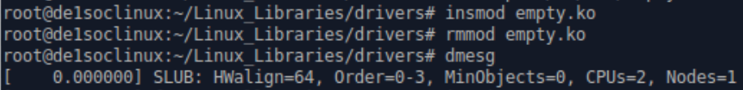

# Laboratoire 3 DRV
Spinelli isaia
05.11.19

lien du laboratoire : http://reds-lab.einet.ad.eivd.ch/drv_2019/lab_03/lab_03.html

[TOC]

## Matériel nécessaire

### Exercice 1

Car le paramètre en question (UIO) n'est pas activé en tant que module donc le noyau nous empêcherait de le charger.
Mais il est possible de refaire une configuration est de le réactiver en module.

### Revenir à la version non-modifiée du noyau grâce à git:
- git status
- git checkout -- arch/arm/boot/dts/socfpga_cyclone5_sockit.dts
- rm tmp -rf
- git status

### Repartir depuis le fichier de configuration d’origine et activer le « Support for large (2TB+) block devices and files »
- make clean
- make ARCH=arm CROSS_COMPILE=arm-linux-gnueabihf- socfpga_defconfig
- make ARCH=arm CROSS_COMPILE=arm-linux-gnueabihf- menuconfig

( Activez le support LBDAF avec "/LBDAF" )

### Nettoyer et recompiler le noyau:
- make ARCH=arm CROSS_COMPILE=arm-linux-gnueabihf- -j12
- make ARCH=arm CROSS_COMPILE=arm-linux-gnueabihf- modules
- make ARCH=arm CROSS_COMPILE=arm-linux-gnueabihf- INSTALL_MOD_PATH="./tmp" modules_install
- make ARCH=arm CROSS_COMPILE=arm-linux-gnueabihf- socfpga_cyclone5_sockit.dtb

### Sauvgarde et mise à jour des fichiers pour le deployement sur la carte

- cp /var/lib/tftpboot/socfpga.dtb /var/lib/tftpboot/socfpga.dtb.old
- cp /var/lib/tftpboot/zImage /var/lib/tftpboot/zImage.old
- cp arch/arm/boot/dts/socfpga_cyclone5_sockit.dtb /var/lib/tftpboot/socfpga.dtb
- cp arch/arm/boot/zImage /var/lib/tftpboot/
- sudo cp ./tmp/lib/modules/4.14.130-ltsi-13527-g567dd6b/ /export/drv/ -R

Ces commandes permettent de copie les anciens fichiers pour les sauvgarder et place le nouveau noyau et dtb dans le dossier **/var/lib/tftpboot/** afin de les deployer sur la carte.
Finalement, place les modules précèdemment compilés dans **/export/drv/**.

Avertissement : le nom du répertoire source dans la dernière commande pourrait changer!! (ajout de sudo)

Sur la carte:
- cd /lib/modules
- rm * -rf
- mv /home/root/drv/4.14.130-ltsi-13527-g567dd6b/ .

Redémarrez la carte. Le noyau chargé devrait maintenant être:
- uname -ar
Linux de1soclinux 4.14.130-ltsi-13527-g567dd6b26fcf #11 SMP Wed Oct 31 14:40:59 CET 2018 armv7l armv7l armv7l GNU/Linux

## Introductions aux périphériques sous Linux

### Exercice 2 (ls -al /dev)

Taper la commande "ls -al /dev" sur votre PC, et essayer de comprendre à quel driver chaque fichier que vous voyez est associé.

Voici les différents fichiers dans le dossier /dev. Je les ai donc groupé par numéro majeur afin de comprendre à quel driver ils sont associés.

Pour m'aider à trouver le driver associer, j'ai utilisé la commande cat **cat /proc/devices** afin de voir le nom du driver et dans quel mode il fonctionne (char ou bloc).

urandom  	1
zero           	1
full          	   1
ram0             1
mem             1
kmsg             1
1 -> mem/ramdisk : Permet d’utiliser la mémoire principale du système en tant que périphérique char(mem) ou bloc(ramdisk).

tty0            4
1 -> tty : Permet une implémentation général des communications séries.

tty / ttyprintk   5
console         	5
5 -> tty/console/printk/ptmx(Pseudoterminal) : Permet une implémentation des communications générales.

loop0           7
vcs                7
7 -> vcs : Mémoire de console virtuel

sda             8
8 -> sd : Le pilote sd est un périphérique en mode bloc, ce qui signifie qu’il est étroitement associé au sous-système du bloc. Il prend également en charge le concept de partitions.

autofs          			10
cpu_dma_latency  10
hpet            			 10
10 -> misc : Driver par caractère générique. (Drivers divers)

sr0             11
11 -> sr : Driver par bloc utile pour le cdrom

sg0             21
21 -> sg : Le pilote Linux sg est un pilote de périphérique de sous-système SCSI de niveau supérieur, utilisé principalement pour gérer les périphériques non couverts par les autres pilotes de niveau supérieur(sd,st,sr).

fb0             29
29 -> fb : Framebuffer permet d'afficher des graphiques sur un système Linux

ppp             108
108 -> ppp : Pilote générique qui fournit une implémentation du fonctionnalité utile dans toute implémentation de protocole point à point.

hidraw0         249
249 -> hidraw : Le pilote hidraw fournit une interface brute aux ports USB et Bluetooth Human Périphériques d'interface (HID).

ptp0            250
250 -> ptp : Infrastructure d'horloge matérielle pour Linux

watchdog0       253
253 -> watchdog : Permet d'aider pour l'implémentaion d'un watchdog (circuit matériel qui peut réinitialiser le système informatique en cas de défaillance du logiciel).

rtc0            254
254 -> rtc : Les horloges temps réel utilise cette API.

ttyUSB0         188
Le périphérique /dev/ttyUSB0 au majeur 188 correspond lui à un matériel bien réel.
C’est le convertisseur USB/série de la DE1-SoC, visible sur la machine si le câble USB est branché au connecteur console de la carte.
Pour récupérer plus d’informations sur ce périphérique, les systèmes de fichiers virtuels /proc et /sys sont utiles.

### Exercice 3 (mknod)

mknod permet de créer des fichiers spéciaux.

Créer ensuite un fichier virtuel de type caractère avec le même couple majeur/mineur du fichier /dev/random. Qu’est-ce qui se passe lorsqu'on lit son contenu avec la commande cat?

/dev/random : numéro majeur = 1 / numéro mineur = 8

sudo mknod test c 1 8

Lecture du fichier :

On peut voir quand dans les deux cas, des valeurs random sont générées environ toutes les 4 secondes. De plus, la lecture du fichier est constante.

### Exercice 4 (proc)
Retrouvez l'information du périphérique ttyUSB0 de type caractère dans le fichier /proc/devices.

afficher le fichier /proc/devices avec cat:

On peut voir que le périphérique /dev/ttyUSB0 est un périphérique de type caractère.

### Exercice 5 (sysfs)

sysfs contient davantage d’informations sur le périphérique.
Retrouver dans l’arborescence de sysfs, en particulier pour ce qui concerne le nom du driver utilisé et le type de connexion.

On peut voir que le driver ftdi_sio est utilisé pour ce driver.

Ensuite, utiliser la commande lsmod pour confirmer que le driver utilisé est bien celui individué auparavant, et cherchez si d’autres drivers plus génériques sont impliqués.

Ici on voit clairement que le driver ftdi_sio utilise un driver encore plus générique qui est usbserial.

## Compilation de modules

En général, un driver simple se présente sous la forme d’un fichier C unique. Dans l’arborescence du noyau, les drivers compatibles avec toutes les architectures se situent dans le répertoire drivers à la racine du code source du noyau Linux. Les sous-répertoires représentent les différentes familles de périphériques. Le dossier char, par exemple, contient tous les périphériques de type char supportés, dont random et zero que nous avons vu auparavant. Lors de la compilation du noyau et selon les options de compilation choisies, les fichiers sources contenus dans ce répertoire seront inclus dans le noyau ou pas.

Pour nos tests, il est plus simple de compiler un driver séparément. Pour faire ceci, il est nécessaire d’avoir les sources du noyau pour lequel le driver doit être compilé, et ces sources doivent déjà être configurées et un make modules doit avoir été préalablement effectué (ce qui est déjà le cas si les sources ont déjà été compilées une fois).

*Remarque :
Si vous êtes sous une distribution de type Debian ou dérivée, pour compiler des modules pour votre machine vous devez installer le paquet linux-headers correspondant à votre version du noyau (déjà installé sur la machine de laboratoire).*

*sudo apt-get install linux-headers-$(uname -r)*

### Exercice 6 (empty module)

Compiler le module empty disponible dans l’archive des sources de ce laboratoire. Ensuite, il faut monter le dans le noyau, le démonter, et analyser les messages enregistrés dans les logs.

Après avoir un répertoire avec le bon Makefile et le bon chemin jusqu'à la source du noyau et le fichier source de empty, j'ai pu faire un make afin de généré le empty.ko.
Ensuite, j'ai placé sur empty.ko dans /export/drv afin de le récupérer sur le carte DE1.
Après, j'ai placé ce module dans Linux_Librairies/drivers pour pouvoir le monter avec insmod.
Puis, le démonter avec rmmod.

Finalement, afficher les messages enregistrés avec dmesg.

Remarque :
Lorsqu’on désire insérer un module ayant été compilé avec le noyau, la commande modprobe est préférée à la commande insmod, car elle va directement chercher le module dans le bon sous-répertoire de /lib/modules/ suivant le version du noyau démarré. Cette commande prends comme paramètres le nom du module (pas le chemin complet ni l’extension .ko), et s’occupe également de résoudre les dépendances entre modules en montant celles-ci avant le module demandé si nécessaire.

### Exercice 7 (parrot module)

 Le module parrot_driver (disponible dans les sources de ce laboratoire), est un driver minimal de périphérique virtuel de type caractère. Il possède un majeur de 97. Un fois un device node associé à ce module, il est possible d’y écrire une chaîne de caractère, et de la récupérer à l’identique ou modifiée via une lecture standard. La configuration de la modification à effectuer sur la chaîne est réalisée grâce à un appel à ioctl() sur le device node. Un appel ioctl() prends deux paramètres entiers, et renvoie un entier. Le programme ioctl.c permet d’effectuer ces appels facilement. Si le premier paramètre de ioctl vaux 1, tout le contenu de la chaîne contenue dans le driver est mis en majuscule (si arg2 == 0) ou minuscule (si arg2 == 1). Si arg1 == 0, la casse est inversée.

 Pour commencer, j'ai adapté 2 Makefiles afin de compiler pour ma machine et pour cross-compiler pour la carte DE1-soc.
 Une fois compilé, j'ai pu insérer les modules sur les machines respectives tous en confirmant le bon montage des modules avec la commande dmesg.

 

Voici les informations possibles de récupérer sur ce périphérique avec les outils vu précédemment:

Dans /proc/devices :

Avec la commande lsmod :

Dans /proc/modules:

Et finalement, dans sys/module :

Ensuite, j'ai crée un device node adapté au driver parrot et ajouter les droits pour un utilisateur courant puisse y accéder.

Ici on peut observer une lecture sur le device node ainsi qu'une modification de la configuration.

Ensuite, comme demandé, voici le démontage du module.

Il a fallu créer un lien symbolique du module dans le bon répertoire de /lib/modules afin de pouvoir utiliser modprobe pour le monter.

Voici comment créer le lien:

Vérification du lien:

Afin que le module se charge automatiquement au démarrage, il faut ajouter celui-ci dans le fichier /etc/modules :

Voici enfin le montage du module avec la commande modprobe :

Voici les logs du kernel au démarrage du système :

Remarque: Le premier message signifie que le module n'est pas signé par le fournisseur.

Remplacement de la fonciton register_chrdev() qui ne devrait pas être utilisée à partir du noyau 2.6 par les bons appels à cdev().

Le code final est commenté, il est en annexe (parrot.c)

Référence: https://gist.github.com/itrobotics/063aea3c72d1f7d7fb94

Afin de m'assurer que le module fonctionne encore correctement, j'ai vérifié que le module soit actif et que on pouvait encore lire/écrire et modifier.

Vérification du module actif :

Vérification du bon fonctionnement :

Finalement, il a fallu modifier le module Parrot afin de pouvoir lire/écrire nos chaines de caractères en format binaire. Pour ce faire, j'ai commencé par écrire un logiciel userspace qui permet d'écrire dans le device node en binaire (de 0 à 9 afin de tester toutes la range) qui s'appelle writeParrot que vous pouvez voir un annexe.

Ensuite, j'ai modifié le driver afin de modifier l'écriture de 0 à 9 en binaire en ASCII.

Afin de tester le bon fonctionnement du nouveau driver, j'ai recharger le module en faisant:

**make -> sudo modprobe -r parrot -> sudo modprobe parrot**

Puis, lancer mon logiciel userspace afin d'écrire en binaire dans le device et lu avec cat ainsi que le logiciel userspace pour confirmer les bonnes modifications :

On peut observer que la modification des chiffres en binaire se fait correctement.

Pour le read de parrot, il n'est pas nécessaire de le modifier car tous ce qu'on écrira dans le module via le driver sera déjà convertie en ASCII.

## Conclusion

Je pense que ca laboratoire est très instructif pour une bonne introdiction aux drivers et modules de linux.
Par contre, je pense que le temps laissé pour ce laboratoire est relativement court.
