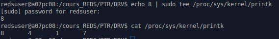

# Laboratoire 4 DRV
Spinelli isaia
Début : 06.11.19

lien du laboratoire : http://reds-lab.einet.ad.eivd.ch/drv_2019/lab_04/lab_04.html

## Objectifs

- Savoir créer des drivers simples
- Comprendre les outils disponibles pour effectuer des transferts entre le user-space et le kernel-space

## Matériel nécessaire

 Premièrement, il faut l’archive qui contient les sources pour ce laboratoire.

 De plus, il faut modifier le device tree en rajoutant à nouveau les lignes nécessaires pour avoir des intérruptions depuis les boutons. Il faut donc modifier le fichier arch/arm/boot/dts/socfpga_cyclone5_sockit.dts en ajoutant à la ligne 35:

     drv-btn {
       compatible = "drv-btn";
       reg = <0xFF200000 0x1000>;
       interrupts = <0 41 1>;
       interrupt-parent = <&intc>;
     };

Compiler et copier ensuite avec:

**make ARCH=arm CROSS_COMPILE=arm-linux-gnueabihf- socfpga_cyclone5_sockit.dtb**
**cp /var/lib/tftpboot/socfpga.dtb /var/lib/tftpboot/socfpga.dtb.old**
**cp arch/arm/boot/dts/socfpga_cyclone5_sockit.dtb /var/lib/tftpboot/socfpga.dtb**

## Structure d’un module

Un module noyau minimaliste peut être très simple, comme on peut le voir dans les sources du module empty_module en annexe.

Chaque module doit obligatoirement déclarer une fonction d’initialisation, appelée lors du insmod, et une fonction de cleanup, appelée lors du rmmod. Le nom donné à ces fonctions est libre, mais celle-ci doivent être déclarées comme étant les points d’entrée et de sortie du module via les fonctions module_init et module_exit. La déclaration de l’auteur et de la licence n’est pas strictement nécessaire, mais importante dans certains cas.
Plus de détail ici : https://lwn.net/Articles/82305/

De plus, ce module n’expose pas de numéros de majeur/mineur, ni de fonctions de lecture/écriture, spécifiques au périphériques de type char ou de type block. Il ne peux donc pas être accédé par un device node.

Utilisée dans un **printk**, la constante KERN_ERR permet de préciser que le message que l’on désire afficher est de type « erreur ». Il existe en tout **8 catégories de messages** différentes:

0. KERN_EMERG (système inutilisable)
1. KERN_ALERT (action immédiate requise)
2. KERN_CRIT (conditions critiques)
3. KERN_ERR (erreur)
4. KERN_WARNING (attention)
5. KERN_NOTICE (condition normale mais significative)
6. KERN_INFO (information)
7. KERN_DEBUG (informations de debug)

Ces niveaux de sévérité permettent de classifier les différents messages en provenance du noyau. Ces niveaux sont aussi utilisés pour décider quels messages seront affichés dans la console et quels autres seront juste enregistrés dans le log kernel. Ce « filtrage » est appelé **loglevel**. Le fichier **/proc/sys/kernel/printk** permet de connaître le loglevel actuel du système.

- Preimer chiffre   : loglevel de la console
- Deuxieme chiffre  : loglevel par défaut
- Troisième chiffre : loglevel minimal d'une console
- Quatrieme chiffre : loglevel au boot

Notez que, peu importe le loglevel, tous les messages noyau sont enregistrés dans le log, accessible via dmesg.

Le loglevel par défaut de la console courante est modifiable par root:

Notez que les messages noyau ne sont jamais affichés dans un terminal de type GUI (xterm, konsole, …) Ils sont affichés sur les terminaux de type tty ou série uniquement (Ctrl+Alt+F[1..6] pour basculer dans un de ces terminaux sur la machine de labo).

## Transfert de données user <-> kernel

Le noyau et l’espace utilisateur possèdent deux espace d’adressage distincts. Par exemple, lorsqu’un logiciel user-space effectue un appel système pour lire depuis un dispositif, le pointeur contenant l’adresse à laquelle copier les données contient une adresse valide uniquement dans le contexte d’exécution du programme dans l’espace utilisateur. Il est donc nécessaire d’effectuer une traduction d’adresse; on utilise pour cela la fonction copy_to_user plutôt qu’un simple memcpy. La fonction permettant un transfert de données dans l’autre sens est logiquement appelée copy_from_user.

Pour transférer des types simples, comme des entiers ou des caractères, une autre paire de fonctions plus légères existent, put_user et get_user.

D’autres fonctions aidant à ces transferts user <-> kernel existent: access_ok est une fonction de vérification d’adresse, strnlen_user et strncpy_from_user sont des fonctions servant à gérer les transferts de tampons terminé par un byte nul.

La gestion des espaces mémoire dans le noyau Linux est expliquée en détail ici : https://developer.ibm.com/articles/l-kernel-memory-access/

### Exercice 1 : Correction driver

MAJOR -> MAJOR_NUM (MAJOR déjà définie)

FILE  -> file (FILE vient de la libraire stdio qui ne peut pas êrte utilisé ici)

Include <linux/uaccess.h> -> copy_to_user (Il faut inclure uaccess.h pour utiliser copy_to_user)

const char message[] = DEVICE_NAME; -> char * car le 1er arg de copy_to_user doit être un pointeur avec des données non consantes.

int* msgLength -> unsigned long car le 3eme arg de copy_to_user prend un unsigned long

file_operations avait plusieurs erreurs, deja il a fallait pas référencer l'adresse de la fonction hello_read. De plus il faut faire coresspondre la prototype de la fonction read à hello_read. Finallement, il faut ajouter un virgule  après THIS_MODULE pour séparer les 2 affectations des champs différents.

kstrlen n'existe pas, il faut utiliser strlen.

le printk de hello_init 2 arguments avec 2 chaine de caractère. printk prend seulement une chaine de caractère en argument. Donc, il a fallu les concatener ("Hello!\nworld\n"). De plus, le loglevel ne doit pas être séparé par une virgule car printk prend un argument.
Il en est de même pour la fonction hello_exit, printk prend qu'un argument.

module_init() et module_exit() prend en paramètre la fonction respective pour initiliser et supprimer le module donc hello_init et hello_exit.

Maintenant le module compile ! =D

Il est donc maintenant possible de compiler / monter et demonter le module :

On peut aussi voir dans /proc/devices que notre module est bien présent avec le numéro majeur de 98 de type caractère:

Une fois monté, j'ai créer un node virtuel au numéro majeur de 98 (**sudo mknod /dev/nodeHel c 98 0**) afin de tester l'écriture via le module hello. Malheureusement, la lecture ne donnait rien et restais bloquée. De ce fait, j'ai corriger le module afin de lire le nom du module à chaque lecture.

Pour commencer, il a fallu ajouter les tests des inputs dans hello_read. Ensuite, il a fallu adapter l'appelle de la fonction copy_to_user pour copier le message (nom du module) dans le buffer côté userspace avec le bon nombre de byte à copier. Finalement, tester la valeur de retour de la fonction copy_to_user.

Une fois la fonction read plus correcte, il est maintenant possible de lire le node virtuel avec **cat /dev/nodeHel** :

 Afin de rendre le module plus robuste, je me suis insprié du laboratoire precedent afin de ne plus utiliser la fonction register_chrdev() qui ne devrait pas être utilisée à partir du noyau 2.6.

## Allocation dynamique de mémoire

Dans l’exercice précédent la mémoire nécessaire pour la chaîne de caractères était allouée statiquement. Il est possible d’allouer dynamiquement de la mémoire dans le noyau à l’aide de fonctions similaires à malloc et free: kmalloc et kfree. Ces fonctions se comportent comme leurs homologues de l’espace utilisateur, hormis le fait que kmalloc est plus finement paramétrable, possédant un argument supplémentaire obligatoire.

**void * kmalloc(size_t size, int flags)**
- size  = combien de byte de memoire sont nécessaires
- flags = le type de mémoire à allouer

Plus de précision ici : https://www.kernel.org/doc/htmldocs/kernel-api/API-kmalloc.html

Et encore plus de détail ici (Chapitre 8): https://lwn.net/Kernel/LDD3/

### Exercice 2 : Allocation mémoire

Le but de cet exercice est de remplacer l’allocation statique de la chaîne de caractères dans l’exercice précédent avec une allocation dynamique.

Dans un module, la mémoire à laquelle nous avons accès est réservée au noyau. Cependant, il s’agit encore, comme dans l’espace utilisateur, de mémoire paginée dans un espace d’adressage virtuel. Si l’on désire accéder à l’adressage physique d’un périphérique, un appel à la fonction ioremap s’avère nécessaire. Cette fonction permet de mapper une intervalle d’adresses physique dans l’espace d’adressage du noyau. Une fois la conversion effectuée, il existe plusieurs fonctions permettant de transférer des données entre les deux domaines: iowrite/ioread pour les types simples, et memcpy_fromio/memcpy_toio pour les tampons en chaînes de caractères.

## Interruptions

Le noyau Linux expose un mécanisme simple pour la gestion des interruptions. Un appel à request_irq permet d’enregistrer une fonction comme routine pour un IRQ donné, et free_irq permet de libérer le numéro d’IRQ.

Un paramètre flags peut combiner plusieurs valeurs, par exemple:

- IRQF_DISABLED, précisant si les interruptions doivent être désactivées ou non lors de l’exécution de la routine (s’applique uniquement au processeur traitant l’interruption courante!)
- IRQF_SHARED, précisant si le numéro d’IRQ est partagé.

Notez que dans le hardware récent, x86 surtout, les numéros d’IRQ sont souvent partagés par plusieurs périphériques. Si l’exclusion mutuelle est requise pour la routine de service, il est aussi possible de désactiver les interruptions sur la ligne IRQ courante en appelant disable_irq ou disable_irq_nosync.

Pour plus d’infos ici (chapitre 10) : https://lwn.net/Kernel/LDD3/

## Données privées, platform drivers, et device tree

Les drivers n’existent pas dans un vacuum, mais ils sont généralement inclus dans **un sous-système**. Par exemple, les drivers des périphériques sur bus I2C seront dans le système I2C, ceux sur PCIe dans le sous-système PCI, … Utiliser l’interface offerte par le sous-système permet de **disposer d’une série de fonctionnalités communes** aux périphériques du même type.

Les platform drivers, en particulier, sont utilisés lorsqu’on a un type de périphérique qui n’est pas discoverable, ils sont donc très utilisés dans le monde embedded. Vous pouvez en trouver une présentation détaillée ici : https://lwn.net/Articles/448499/

Malgré les points en commun, chaque driver à des exigences particulières, par exemple il veut stocker deux différents pointeurs à la mémoire, ou bien deux numéros de IRQ. Pour garder ces informations privées au driver et, au même temps, pouvoir les passer entre les différents appels à fonction sans avoir des interfaces byzantines, Linux a introduit la notion de données privées. Il s’agit d’une structure de données qui peut être récupérée depuis certains paramètres (dans une façon qui change, malheureusement, d’un sous-système à l’autre).

### Exercice 3 : Commentaires

Le module pushbutton_example offre un exemple d’utilisation de

- interruptions.
- platform driver.
- informations récupérées depuis le device tree.

Comme demandé, j'ai commenté toutes les lignes utiles du code fourni (pushbutton_example.c).

Questions spécifiques :

Qu’est-ce que c’est un platform driver ?

Comment les informations sont récupérées depuis le device tree ?

Comment les données privées sont traitées/récupérées ?
